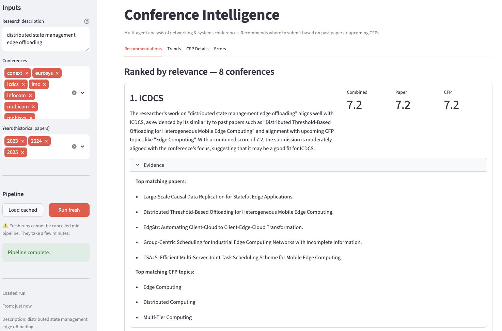
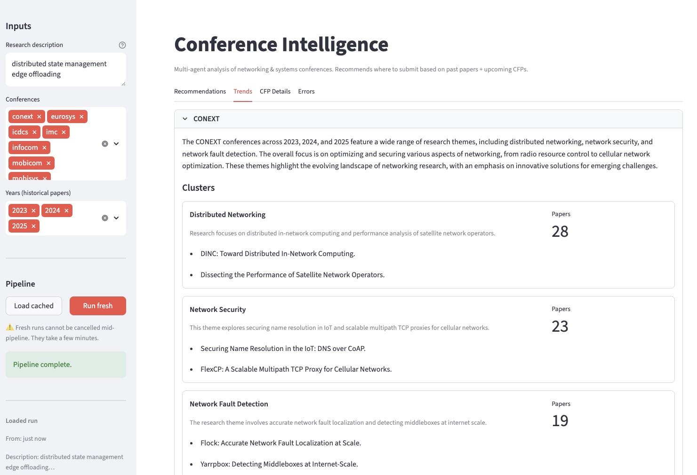

### Overview

Multi-agent research conference intelligence and recommendation system.
The user provides a research description and the system scrapes paper metadata from academic conferences, discovers trends, fetches CFP deadlines, and recommends the best conferences to submit to. Built with LangGraph.

Currently supported conferences: SIGCOMM, CoNEXT, IMC, MobiSys, MobiCom, EuroSys (ACM), INFOCOM, ICDCS (IEEE). Papers covered: 2023–2025.

#### Architecture

The pipeline consists of five agents in a sequential DAG, with a shared `PipelineState`.
Each agent reads from the shared state, completes its own task, and writes results back.

```
registry → paper_scraper → cfp_scraper → trend_analysis → relevance → END
```

##### registry_agent.py
First pipeline node. Resolves conference scope into fully populated metadata (URLs, DBLP keys, CFP URLs). Also exposes a conversational CLI for manual registry management. LLM: Ollama.

##### paper_agent.py
Scrapes paper metadata from DBLP, enriches abstracts via OpenAlex, computes and persists embeddings to parquet. No LLM. Smart cache per `(conference, year)` to avoid full re-scrape when only new conferences or years are added.

##### cfp_agent.py
Fetches and parses CFP pages per conference, extracts deadlines and topic areas. Registry-driven URL resolution with year substitution. Manual override path for JS-rendered pages. LLM: Groq.

##### trend_agent.py
Clusters papers per conference using KMeans, labels clusters and writes conference summaries (Groq), and interprets year-over-year trajectory (Ollama). Separates deterministic clustering from LLM-generated descriptions.

##### relevance_agent.py
Ranks conferences against the user's research description using deterministic cosine similarity over papers and CFP topics. CFP-weighted scoring `(0.3 × paper + 0.7 × CFP`). LLM: Ollama for rationale only.

#### Stack

| Layer | Choice |
|---|---|
| Agent framework | LangGraph 1.2.1 |
| LLM (quality calls) | Groq `llama-3.3-70b-versatile` |
| LLM (quota-free calls) | Ollama `llama3.1:8b` |
| Embeddings | `all-MiniLM-L6-v2` (sentence-transformers) |
| Paper metadata | DBLP XML |
| Abstract enrichment | OpenAlex API |
| Registry storage | SQLite |
| Data storage | Parquet |
| Caching | File-based JSON `(core/cache.py`) |
| Runtime | Python 3.11+ |

#### Quick Start

**Prerequisites:**
- Groq API key set as `GROQ_API_KEY` environment variable
- Ollama running locally with `llama3.1:8b` pulled
- `pip install -r requirements.txt`

```
streamlit run dashboard/app.py
```

Provide a short description of your research, select conferences and years, and press **Run Fresh** to start the pipeline.



#### Dashboard

The dashboard has four tabs: Recommendations, Trends, CFP Details, and Errors.

**Recommendations** — highest-ranked conference matches with rationale and matching CFP topics.

**Trends** — most popular themes per conference, year over year.

**CFP Details** — trending topics and submission deadlines per conference.

**Errors** — any errors accumulated during the pipeline run, such as failed CFP fetches or missing abstracts.




#### Known Limitations

- USENIX-published venues (NSDI, OSDI, USENIX Security) not supported due to insufficient abstract coverage across enrichment sources
- Poster and demo filtering uses a 4-page threshold; would need recalibration for venues with very short full papers
- Streamlit "Run Fresh" cannot be cancelled mid-execution from the UI
- Cache check in `paper_agent` triggers a full re-scrape if any `(conference, year)` combination is missing; missing slices are not fetched incrementally
