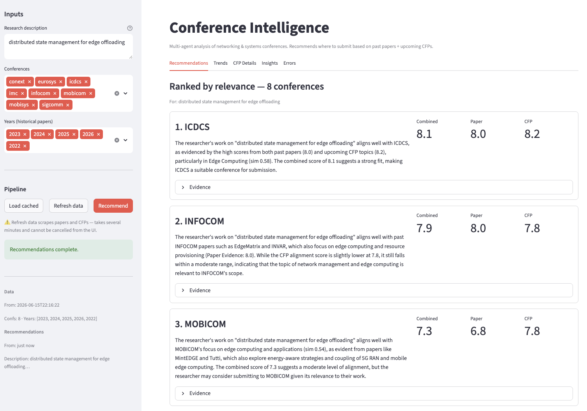
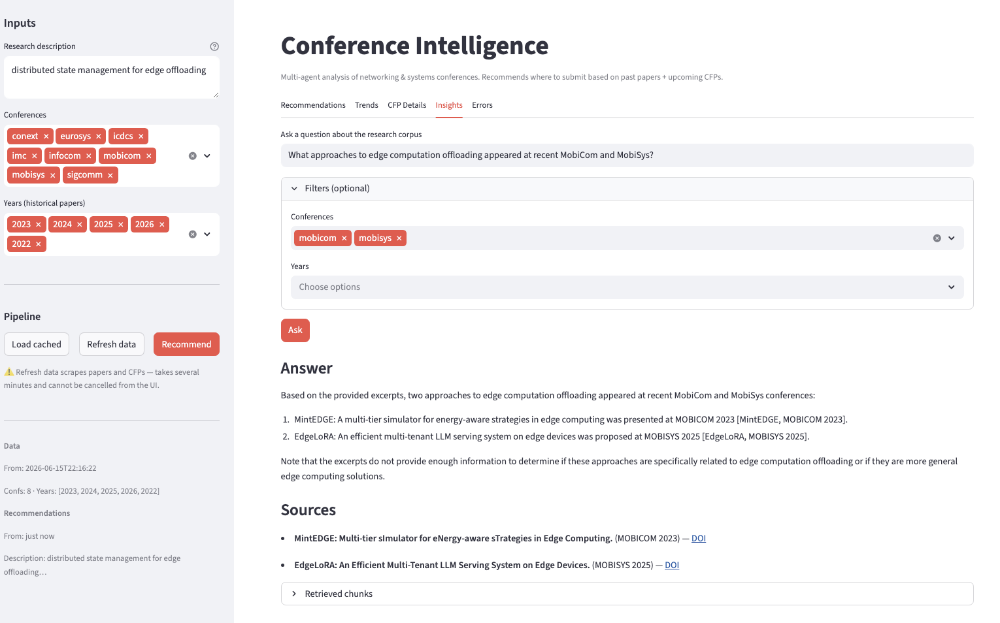

### Overview

Multi-agent research conference intelligence and recommendation system.

The user provides a research description and the system scrapes paper metadata from academic conferences, discovers trends, fetches CFP deadlines, and recommends the best conferences to submit to. Built with LangGraph.

Currently supported conferences: SIGCOMM, CoNEXT, IMC, MobiSys, MobiCom, EuroSys (ACM), INFOCOM, ICDCS (IEEE). Papers covered: 2022–2026.

#### Architecture

The system runs as two independent graphs sharing a common data layer.

**Data graph** — run rarely, when you want fresh papers and CFPs:
```
registry → paper_scraper → cfp_scraper → trend_analysis → END
```

**Query graph** — run on demand, once per research description:
```
registry → relevance → END
```

The query graph reads the paper parquet directly. CFP topics are supplied by the caller (the dashboard from its last run, the API from the tracked snapshot in `data/cfp_export.json`). No scraping happens during recommendations.

##### registry_agent.py
First node in both graphs. Resolves conference scope into fully populated metadata (URLs, DBLP keys, CFP URLs). Also exposes a conversational CLI for manual registry management. LLM: Ollama.

##### paper_agent.py
Scrapes paper metadata from DBLP, enriches abstracts via OpenAlex, computes and persists embeddings to parquet. No LLM. Smart cache per `(conference, year)` to avoid full re-scrape when only new conferences or years are added.

##### cfp_agent.py
Fetches and parses CFP pages per conference, extracts deadlines and topic areas. Registry-driven URL resolution with year substitution. Manual override path for JS-rendered pages. LLM: Groq.

##### trend_agent.py
Clusters papers per conference using KMeans, labels clusters and writes conference summaries (Groq), and interprets year-over-year trajectory (Ollama). Separates deterministic clustering from LLM-generated descriptions.

##### relevance_agent.py
Ranks conferences against the user's research description using deterministic cosine similarity over papers and CFP topics. Final score is `α × paper + (1-α) × CFP`, with `ALPHA = 0.85` (see Evaluation). Both components are size-normalised: the paper score is the mean of each venue's top-decile similarities rather than a fixed top-k, and the CFP score is the mean of the top 3 topic similarities rather than a single max. LLM: Groq, for the rationale text only; it never enters the score.

#### Stack

| Layer | Choice |
|---|---|
| Agent framework | LangGraph 1.2.11 |
| LLM (hosted) | Groq `openai/gpt-oss-120b` (CFP extraction, cluster labels, RAG answers, rationales) |
| LLM (local) | Ollama `llama3.1:8b` (registry CLI, trend trajectory) |
| Embeddings | `all-MiniLM-L6-v2` (sentence-transformers) |
| Paper metadata | DBLP XML |
| Abstract enrichment | OpenAlex API |
| Registry storage | SQLite |
| Data storage | Parquet |
| Caching | File-based JSON (`core/cache.py`) |
| Vector store | ChromaDB (persistent, local) |
| Runtime | Python 3.11+ |

#### Quick Start

**Prerequisites:**
- Groq API key as `GROQ_API_KEY`
- Ollama with `llama3.1:8b` only for the registry CLI and trend trajectory interpretation. Recommendations, Insights and the API do not need it.
- `pip install -r requirements.txt`

```
streamlit run dashboard/app.py
```

The registry seeds itself from `SEED_DATA` on first use, from any entry point. Select conferences and years, then:

1. Press **Refresh data** to scrape papers and CFPs. This takes several minutes and only needs to be repeated when you want fresher data.
2. Enter a research description and press **Recommend** to score conferences against it. This is fast and can be re-run with different descriptions without re-scraping.



#### Dashboard

The dashboard has five tabs: Recommendations, Trends, CFP Details, Insights, and Errors.

**Recommendations** — highest-ranked conference matches with rationale and matching CFP topics. Re-run with any research description without touching the underlying data.

**Trends** — most popular themes per conference, year over year.

**CFP Details** — trending topics and submission deadlines per conference.

**Insights** — RAG-powered querying of the paper corpus, with strictly grounded responses and explicit no-result handling.

**Errors** — any errors accumulated during the pipeline run, such as failed CFP fetches or missing abstracts.



#### API

The query path is also exposed over HTTP, separately from the dashboard. The data graph is deliberately not exposed since scraping takes minutes and stays an explicit, local, opt-in run.

```
uvicorn api.app:app --port 8000
```

Startup resolves every artifact that the endpoints need: registry, paper corpus, CFP topics, Chroma index. Missing artifacts cause startup to fail, catching misconfiguration early instead of producing runtime errors or silently re-embedding the corpus on the first request.

| Endpoint | Does |
|---|---|
| `POST /api/recommend` | Ranks venues against a research description. Scores only, no LLM call. |
| `POST /api/rationale` | Generates the rationale for one venue, on demand. |
| `POST /api/ask` | Grounded Q&A over the paper corpus. |
| `GET /api/health` | Corpus scope, CFP source and snapshot date, index status. |

Rationales are generated one venue at a time rather than eight up front since most are never read, and the ranking itself is deterministic cosine work that shouldn't wait on an LLM.

A single-page frontend is served at `/`, with no build step and no external requests.

**CFP snapshot.** CFP topics come from `data/cfp_export.json`, written by `scripts/export_cfp.py` from the last data-pipeline run and tracked in git so a fresh clone has them without scraping. It is a snapshot: topics and deadlines move with each conference cycle, and `/api/health` reports when it was generated. Re-run the export after refreshing data.


#### Known Limitations

- USENIX-published venues (NSDI, OSDI, USENIX Security) not supported due to insufficient abstract coverage across enrichment sources.
- Poster and demo filtering uses a 4-page threshold; would need recalibration for venues with very short full papers.
- **Refresh data** cannot be cancelled mid-execution from the UI; kill the process from the terminal if needed.
- Cache check in `paper_agent` triggers a full re-scrape if any `(conference, year)` combination is missing; missing slices are not fetched incrementally.
- Golden sets are small (10 relevance cases, 25 RAG cases) and graded by a single annotator. Swapping 5 cases for 10 moved NDCG@3 by ~0.05 on identical code, which is larger than most differences the weight sweep resolves; treat individual sweep points as indicative, not decisive.
- Relevance grades are static, so the evaluation cannot reward the one thing CFP topics uniquely provide: what a venue wants *next* year. A venue that has shifted scope shows up in its CFP before it shows up in its published papers.
- Venues list 5–49 CFP topics, so a top-3 mean covers 60% of one venue's list and 6% of another's. A quantile would make the statistic comparable (the same fix already applied to the paper score), but with some venues listing five items a decile is one topic, which is worse. Open issue.
- `MIN_K = 10` in the paper score reintroduces a small size bias for venues under ~100 papers. CoNEXT, the smallest at 106, sits just above that boundary.
- CFP topic granularity varies by venue: some list short phrases, others full prose sentences. The top-3 similarity mean treats them as comparable when they aren't. E.g., SIGCOMM's 5 scope sentences score 0.98 lower (mean CFP score, 0–10, across the golden set) than the 20 short phrases a capped extraction previously produced, despite being the faithful reading of its CFP. Documented, not solved.


#### Evaluation

Hand-rolled harness (`eval/`), with [DeepEval](https://github.com/confident-ai/deepeval) wired in for standard LLM metrics but not yet run.
Two golden sets: 25 RAG cases (20 answerable, 5 unanswerable) and 10 expert-graded relevance cases (single annotator).

**RAG pipeline** (threshold=0.60, top-k=5):

| Metric | Value |
|---|---|
| answer_coverage | 0.750 |
| false_answer_rate | 0.200 |
| groundedness | 0.78–0.86 (4 runs) |

`hit_rate` and `mrr` read 0 because every case in the RAG golden set carries an empty `relevant_chunk_ids`. Populating them means labelling which chunks answer each of the 25 questions, open work. `groundedness` is the only metric here that does not reproduce: answers come from a hosted model, and `temperature=0` does not make a served MoE bit-reproducible. Four runs on identical code and an identical corpus gave 0.782, 0.826, 0.836 and 0.861. Every other metric was identical across all four. A single figure would imply a precision this measurement does not have.

Sweeping the retrieval cutoff from 0.25 to 0.60 leaves answer_coverage at 0.750 and false_answer_rate at 0.200 unchanged; groundedness moves 0.787 / 0.828 / 0.808, which is inside the run-to-run range above. The cutoff is not the binding constraint at top_k=5

**Conference relevance ranking** (paper_weight=0.85, cfp_weight=0.15):

| Metric | Value |
|---|---|
| NDCG@3 | 0.912 |
| Precision@3 | 0.867 |

**Corpus-size bias in the paper score.** The score was the mean of a venue's top-20 paper similarities, but a fixed count is a variable quantile. For the largest venue that's the top 2%, for the smallest the top 19%, so large venues got a bonus unrelated to fit. `scripts/check_size_bias.py` measures it by capping every venue to the same paper count. Measured on the eight-venue corpus, the largest held a top-3 slot in 9 of 10 golden cases and fell to 2.3 when capped. After switching to a fixed quantile (`TOP_Q = 0.10`) it reads 2 uncapped against 2.7 capped.


**CFP topics add no measurable ranking value.** A weight sweep rises monotonically toward paper-only (0.784 at CFP-only against 0.932 at paper-only) and that held for two different CFP statistics, though the SIGCOMM case above shows extraction format also moves it. `ALPHA` is 0.85 rather than 1.0 deliberately. The cost is 0.912 against 0.932, smaller than the ~0.05 the golden set moves when cases are added or swapped, and CFP still supplies the rationale text and the dashboard's topic matches.


##### Known gaps in the harness

- The threshold sweep varies groundedness but not coverage: `top_k=5` binds before the threshold does, so lowering the cutoff to 0.25 admits no additional answers. Sweeping `top_k` alongside the threshold would separate the two.
- DeepEval is wired in but has never been run.

Reports in [`eval/reports/`](eval/reports/). Each carries a config fingerprint covering the embedding model, `top_k`, `ALPHA` and CFP coverage, so runs made under different scoring do not silently compare. Ranking numbers reproduce exactly across both pinned and older pandas/numpy versions.
